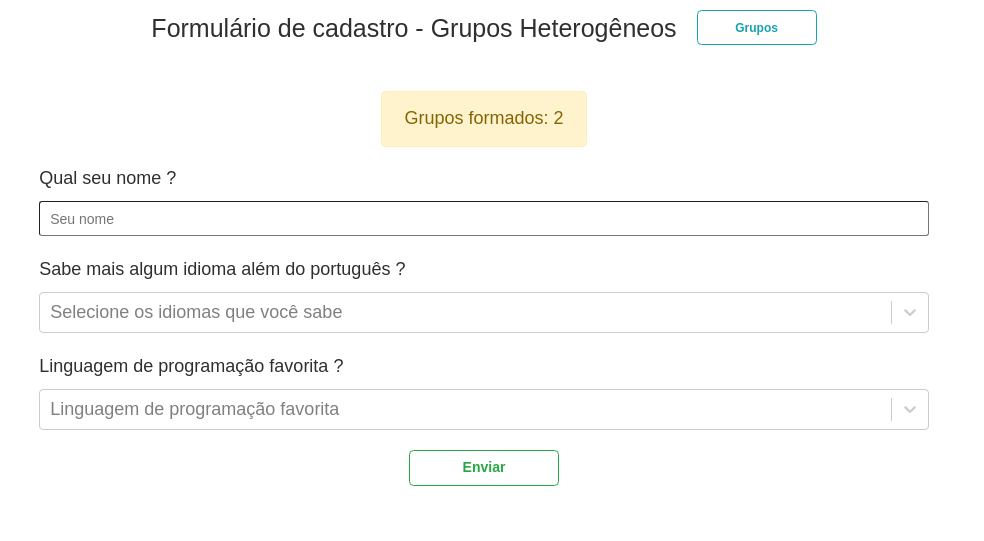
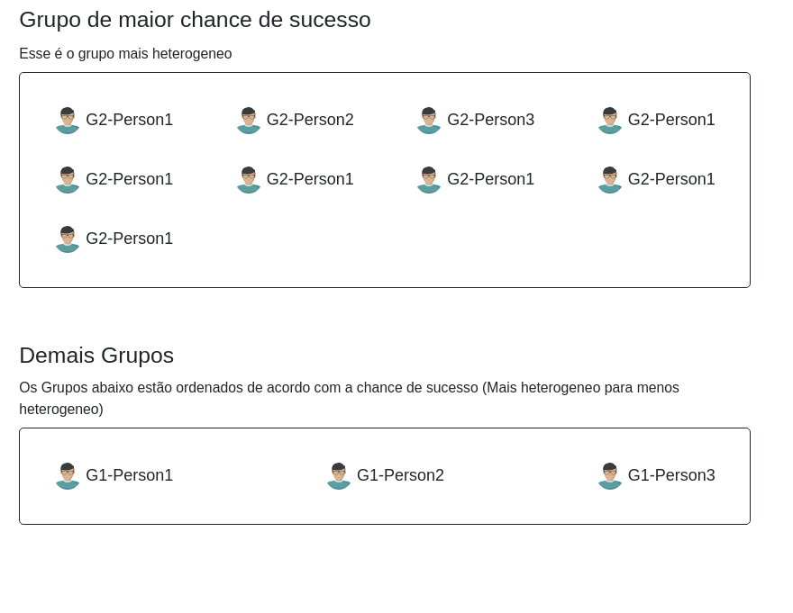
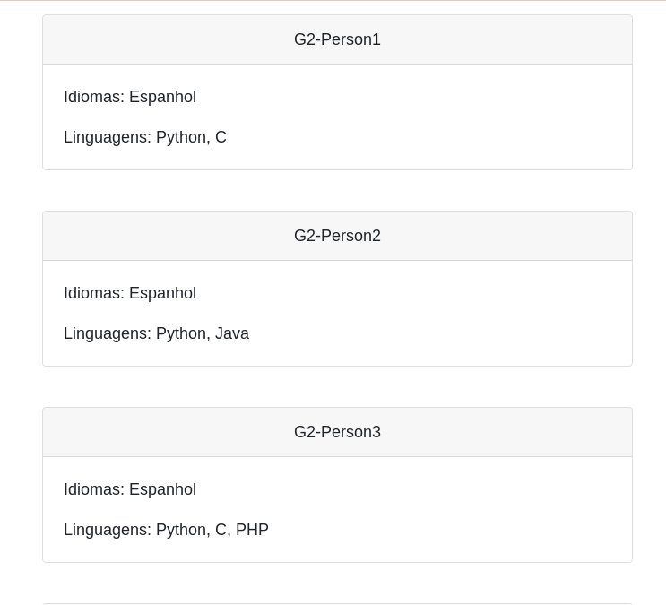

# Grupos Heterogêneos

**Número da Lista**: 29 
**Conteúdo da Disciplina**: Final  

## Alunos

| Matrícula  | Aluno                              |
| ---------- | ---------------------------------- |
| 18/0118005 | Carlos Rafael Vasconcelos de Matos |
| 20/0021541 | Karla Chaiane da Silva Feliciano   |

## Sobre

O objetivo do projeto é definir os grupos com maior chance de sucesso, levando como parâmetro de avaliação a heterogeneidade dos mesmos. Baseado na teoria de que grupos heterogêneos tem uma maior curva de aprendizado.
No projeto foi utilizado [DFS](https://en.wikipedia.org/wiki/Depth-first_search) para computar os componentes do grafo dinamicamente formado e [algoritmos greedy](https://en.wikipedia.org/wiki/Greedy_algorithm) para encontrar os melhores grupos.

## Screenshots

## Instalação

**Linguagem**: JavaScript  
**Ambiente/Framework**: NodeJS - React 

### Dependencias

- **NodeJS** - versão >= v18.12.1

## Uso

Após clonar o repositório, entre no diretorio **web**

#### Execute os comandos:

##### Instalação das dependencias do projeto :

`npm install ou yarn install`

##### Execução do projeto

`npm start`

##### Após executar

A aplicação estará rodando na porta 3000 - `localhost:3000`

### Referências

- https://www.geeksforgeeks.org/number-of-simple-cyclic-components-in-an-undirected-graph/
- https://www.youtube.com/watch?v=LWKHDfmKNcM&t=315s
- https://tophat.com/glossary/h/heterogeneous-grouping/
